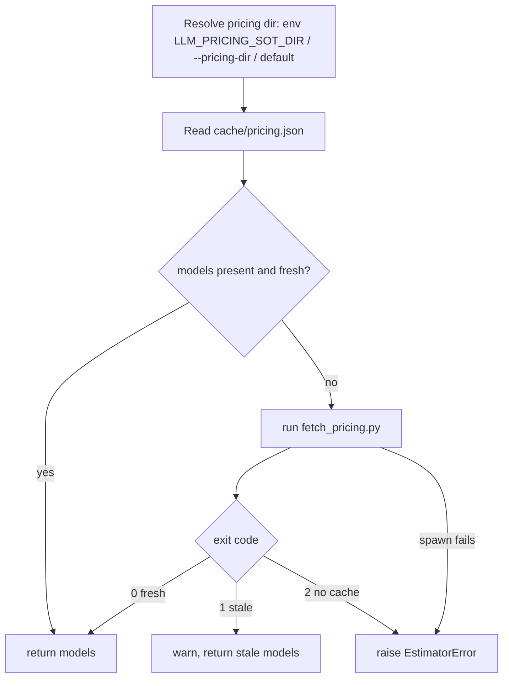

# Consumer Wiring Design

Spec: `consumer-wiring`  
Status: design-approved  
Created: 2026-08-29  
Brainstorm: `./brainstorm.md`
Requirements: `./requirements.md`

## Summary

The pricing pipeline already emits `cache/pricing.json`. This design wires the three consumers to it: `llm-cost-estimator` reads the merged cache and auto-refreshes via `fetch_pricing.py` when stale/missing; Hermes and Pi get a documented stale-aware read path. The approach is file-based — a shared **read/refresh contract** plus a small consumer-side loader — with no HTTP API or daemon. The pipeline core (`fetch_pricing.py`) is unchanged; consumers shell out to it.

## Goals and Non-Goals

### Goals

- Make the cache the single pricing source for `llm-cost-estimator` (FR-002).
- Auto-refresh when the cache is stale/missing, honoring exit codes (FR-003, FR-004).
- Give Hermes/Pi a documented, stale-aware read path (FR-006).
- Keep the cache location configurable rather than hard-coded (FR-005).
- Stay purely file-based — no API/server/daemon (NFR-001).

### Non-Goals

- Any HTTP API / FastAPI / daemon.
- A shared `~/.hermes/data/` path (rejected — repo-local).
- Changing the pipeline's emit/merge/TTL behavior (approved `llm-pricing-pipeline` spec).
- Porting the pipeline core into the consumer; consumers shell out to the existing script.

## Architecture

Two artifacts this spec owns:

1. **The read/refresh contract** (documented convention) — the single shared rule set all consumers follow. Lives in this repo's `README.md` (`### Consuming the cache`).
2. **The `llm-cost-estimator` loader** — a small code change that reads the cache and auto-refreshes.

`llm-cost-estimator` read/refresh flow (in `load_pricing`-equivalent logic, called from `main()`):

- **`resolve_pricing_dir(pricing_dir, env)`** — pick the source dir: explicit `--pricing-dir` > `LLM_PRICING_SOT_DIR` > documented default (the pipeline repo path). (FR-005)
- **`read_pricing_cache(dir)`** — load `<dir>/cache/pricing.json`; return `data["models"]`; `None` if missing/corrupt. (FR-002, FR-008)
- **`cache_is_fresh(cache, now)`** — same staleness rule as the pipeline (`now - fetched_at < ttl_hours`). (NFR-003)
- **`refresh_pricing(dir)`** — run `[sys.executable, "<dir>/fetch_pricing.py"]`, return the exit code; propagate spawn failure. (FR-003, FR-004)
- **`load_pricing_for_wiring(...)`** — orchestrate: fresh → return models; stale/missing → refresh → re-read; honor exit codes. Raises on `2`/spawn-fail. (FR-007)

Hermes/Pi: no code here — they follow the documented contract (read the cache; if `freshness: stale`/`fetched_at` is old, run `fetch_pricing.py` then re-read).

## Data Model

- **No new persisted structures.** The cache schema (`cache/pricing.json`) is owned by the pipeline spec and unchanged.
- **Consumer reads only:** consumers read `data["models"]` (a `{model_id: {in, out, tokenizer, fallback?, source}}` map) plus the freshness envelope (`fetched_at`, `ttl_hours`, `freshness`).
- **Compatibility:** the estimator's existing `load_pricing` validation (requires `tokenizer`; finite non-negative `in`/`out`; `fallback != tokenizer` when present) accepts the cache entries — the cache only contains override-backed models, all of which carry a `tokenizer`. The extra `source` field is ignored by that validation.
- **Identity/uniqueness:** unchanged — `model_id` is the pricing key, already unique in the cache.
- **Migrations:** none. Cache stays repo-local; nothing new is imported.

## API / Interface Changes

- **`llm-cost-estimator` CLI:** add `--pricing-dir <path>` (optional) to point at the pipeline repo; default is `LLM_PRICING_SOT_DIR` (env) then the documented default path.
- **Environment:** `LLM_PRICING_SOT_DIR` (path to the pipeline repo). When unset and no `--pricing-dir`, use the documented default (the known pipeline repo path).
- **`fetch_pricing.py`:** unchanged — invoked as a subprocess by the consumer; exit codes `0` fresh / `1` stale / `2` no cache are the contract.
- **Backwards compatibility:** the estimator retains its legacy `load_pricing(path=data/pricing.json)` path in code for emergency fallback, but `main()` now calls the cache-aware loader by default. No CLI contract is removed.
- **Hermes/Pi:** no programmatic API — documented read steps.

## Error Handling

| Failure | Behavior | Where |
| --- | --- | --- |
| Cache missing/unreadable/stale | Trigger `fetch_pricing.py` (FR-003) | `load_pricing_for_wiring` |
| Script exit `0` (fresh) | Use re-read models | `refresh_pricing` → re-read |
| Script exit `1` (stale) | Warn to stderr, use stale models | `refresh_pricing` |
| Script exit `2` (no cache) | Raise `EstimatorError` (no silent run) | `refresh_pricing` |
| Script spawn fails (not found / non-Python) | Raise `EstimatorError` with the attempted command | `refresh_pricing` |
| No usable pricing at all | Fail loudly, non-zero exit (NFR-004) | `main()` |
| Cache entries invalid (no tokenizer) | Rejected by the estimator's existing validation | `load_pricing` internals |

- **Retries:** none (matches the pipeline; minimal). A failed refresh surfaces as a clear error rather than a retry loop.
- **User-facing errors:** concise; success/failure carried by exit code and a clear message.

## Security and Privacy

- **No secrets:** the cache holds pricing + tokenizer mappings only — no PII, no credentials. No new secret handling.
- **Subprocess trust:** the consumer shells out to a locally resolved script path (`sys.executable <dir>/fetch_pricing.py`). The path is operator-configurable (trusted input), never derived from untrusted/user input; no untrusted args are passed.
- **Data exposure:** repo-local cache; the README notes to keep `overrides.json`/`cache/` out of public commits if prices are sensitive.
- **Auditability:** the consumer logs the outcome (fresh / refreshed / stale-with-warning / failure) to stderr.

## Testing Strategy

- **Unit tests (consumer):**
  - `resolve_pricing_dir` — flag > env > default; unset/wrong default → clear failure.
  - `cache_is_fresh` — fresh / boundary / missing `fetched_at`.
  - `read_pricing_cache` — returns `models`; missing/corrupt → `None`.
  - `refresh_pricing` exit-code mapping (0/1/2) and spawn-failure propagation (inject a fake subprocess runner).
  - `load_pricing_for_wiring` — fresh reads without refresh; stale triggers refresh then reads; exit 2 raises.
- **Integration tests:** end-to-end with a temp pipeline dir containing a real `fetch_pricing.py` stub (or the actual script) and a seeded cache; assert the estimator uses fresh/stale data and fails correctly.
- **Edge tests:** corrupt cache, stale + refresh returns `1`, missing cache + refresh returns `2`, wrong pricing dir.
- **Manual validation:** run `estimate_llm_cost.py --pricing-dir <pipeline-repo> <some-input>` and confirm pricing comes from the cache and that a stale cache triggers a refresh.
- **Hermes/Pi:** doc-only — reviewed as docs, not executed.

## Rollout and Migration

- **Cross-repo, additive:** changes touch `estimate_llm_cost.py` (consumer) and this repo's `README.md`. The pipeline is untouched.
- **Opt-in via config:** cache mode activates once `LLM_PRICING_SOT_DIR` is set (or `--pricing-dir` passed); the default points at the known pipeline repo path. The legacy `data/pricing.json` remains on disk for emergency fallback.
- **Feature flag:** the env var / CLI flag is the switch. No partial rollout; a wrong/missing path fails loudly rather than silently.
- **Rollback:** unset `LLM_PRICING_SOT_DIR` (or remove `--pricing-dir`) and revert to the legacy loader to restore old behavior.
- **Migration of data:** none — the cache is generated by the pipeline; consumers only read it.

## Requirements Traceability

| Requirement | Design Decision | Validation |
| --- | --- | --- |
| FR-001 | Documented read/refresh contract in `README.md` (`### Consuming the cache`); defines cache path, freshness fields, auto-refresh rule | Doc review; contract referenced by consumers |
| FR-002 | `llm-cost-estimator` reads `models` from `cache/pricing.json` via `read_pricing_cache` | Unit/integration test asserts cache model source, not `data/pricing.json` |
| FR-003 | Stale/missing cache → `refresh_pricing` runs `fetch_pricing.py` then re-reads | Integration test: stale cache triggers the script |
| FR-004 | Exit-code mapping: `0` proceed / `1` warn / `2` fail | Unit test of `refresh_pricing` mapping |
| FR-005 | `resolve_pricing_dir` from `--pricing-dir` > `LLM_PRICING_SOT_DIR` > default | Unit test precedence + default/wrong-path error |
| FR-006 | Hermes/Pi read instructions in `README.md` `### Consuming the cache` | Doc review |
| FR-007 | Missing cache + refresh `2`/spawn-fail → raise clear `EstimatorError` | Unit/integration test → raises, no silent run |
| FR-008 | Cache read exposes `freshness`/`fetched_at` alongside `models` | Unit test `read_pricing_cache` returns the envelope |
| NFR-001 | No API/server/daemon — file + subprocess only | Review: no server process/endpoint in design |
| NFR-002 | `fetch_pricing.py` unchanged; no third-party deps added to the pipeline | Review + pipeline tests still green |
| NFR-003 | `cache_is_fresh` uses the same `fetched_at`/`ttl_hours` rule | Unit test determinism/boundary |
| NFR-004 | Unrecoverable read/refresh → clear error, non-zero exit | Unit/integration test raises/exit non-zero |

## Risks and Trade-offs

- **Repo-local path is fragile.** Consumers must know the pipeline repo location. *Mitigation:* configurable via `--pricing-dir`/`LLM_PRICING_SOT_DIR`; a documented default; wrong path fails loudly. *Alternative rejected:* a `~/.hermes/data/` shared path (rejected — adds a second copy/migration).
- **Consumers shell out to the pipeline.** Adds a subprocess dependency and a small startup cost on refresh. *Mitigation:* refresh only occurs when stale; fresh reads are pure file reads (no subprocess). *Trade-off:* acceptable; avoids porting the core.
- **Cache only carries override-backed models.** The tokenizer-drop behavior (pipeline spec) means some models won't appear. *Mitigation:* `llm-cost-estimator` behavior is unchanged for models it can't price; missing models are simply absent. *Accepted* (from the pipeline spec decision).
- **Two copies of staleness logic.** The consumer re-implements the freshness rule. *Mitigation:* keep it minimal and aligned with the pipeline's rule; document it. *Alternative:* expose a helper — rejected because it'd add a shared dependency/import.
- **Concurrent refresh.** Two consumers may trigger refresh simultaneously; the pipeline rewrites the cache on each run. *Mitigation:* idempotent regenerate; a single file write; no corruption. *Trade-off:* a redundant refresh is harmless.

**Next gate:** task planning (`tasks.md`), locked until this design is approved and its `Status` is `design-approved`.
