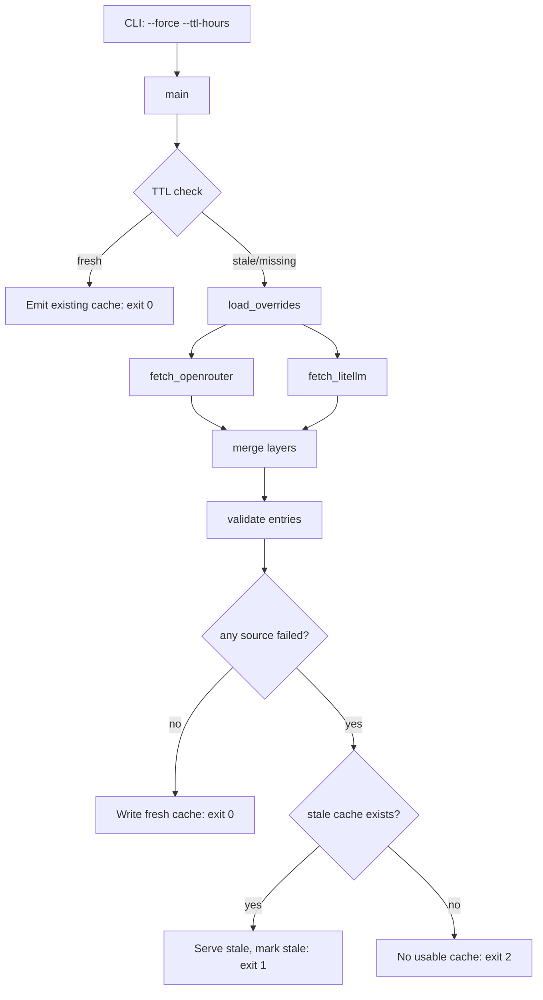

# LLM Pricing Pipeline Design

Spec: `llm-pricing-pipeline`  
Status: design-approved  
Created: 2026-08-29  
Brainstorm: `./brainstorm.md`
Requirements: `./requirements.md`

## Summary

`fetch_pricing.py` is a small, stdlib-only Python 3.9+ CLI that maintains the single source of truth for LLM pricing. On invocation it checks a TTL-gated local cache (`cache/pricing.json`); if the cache is fresh it serves it with zero network I/O. If the cache is stale or missing, it fetches two public sources — the OpenRouter models API (baseline) and the LiteLLM raw JSON (multi-provider discovery) — merges them with a hand-maintained truth layer (`overrides.json`) by strict precedence (overrides > LiteLLM > OpenRouter) using per-field deep merge, validates each output entry, and writes a fresh cache with freshness metadata. On any source-fetch failure it never blocks: it serves stale cache (exit `1`) or, with no usable cache, exits `2`. The design keeps the pipeline additive and consumer-agnostic — wiring `llm-cost-estimator`/Hermes/Pi to the cache is deferred to a later spec.

## Goals and Non-Goals

### Goals

- Provide current, trustworthy pricing to any consumer via a single cache file (FR-001, FR-003).
- Avoid unnecessary network work on cache hits, and never block on the network (FR-002, NFR-003).
- Keep a hand-maintained truth layer that always wins over auto-fetched baselines (FR-007, FR-009).
- Emit staleness metadata so consumers can judge freshness without extra calls (FR-006, FR-008).
- Be hermetic-testable and stdlib-only so it runs anywhere an agent runs (NFR-001, NFR-002).
- Give agents deterministic exit codes to branch on (NFR-004).

### Non-Goals

- Wiring consumers to the merged cache (cache-shared-path decision, `llm-cost-estimator`/Hermes/Pi read paths) — a later spec.
- Hugging Face as a pricing source; any authenticated source; cron/keep-warm scheduling.
- UI, daemon, or long-running service.
- Backfill/migration of existing `llm-cost-estimator` data (seed only, via `overrides.json`).

## Architecture

Single executable module with small, injectable pure functions. No framework, no package install. Tests import the module and inject fake fetchers.



- **`main(argv)`** — parse args, resolve TTL, drive the TTL gate, orchestrate fetch→merge→emit, map outcomes to exit codes.
- **`load_overrides(path)`** — read layer-1 truth; missing/empty → empty layer (FR-009).
- **`fetch_openrouter(url, fetcher)` / `fetch_litellm(url, fetcher)`** — HTTP GET + JSON parse; `fetcher` is injected so tests can stub it (NFR-002).
- **`merge(layers)`** — fold layers from lowest precedence (OpenRouter) to highest (overrides) using per-field deep merge; higher-precedence wins per field (FR-007).
- **`validate_entry(entry)`** — non-negative `in`/`out`, `tokenizer` present; drop/flag invalid (NFR-005).
- **`emit(payload)` / `is_fresh(cache, ttl, now)`** — write the cache; compute freshness from `fetched_at` vs TTL.

Data flow (fetch path): parse args → resolve TTL → load cache → if fresh and not `--force`, emit (exit 0) → else load overrides, fetch both sources → merge → validate → write fresh cache (exit 0). On any source failure, serve stale cache (exit 1) or fail (exit 2).

## Data Model

**`overrides.json`** — hand-maintained, highest precedence. Shape: `{ "<model_id>": {"in": num, "out": num, "tokenizer": str, "fallback": str, "alternatives": [{"provider": str, "in": num, "out": num}] } }`. Entries may be partial (deep-merge inherits omitted fields from the next layer). Uniqueness key: `model_id`.

**`cache/pricing.json`** — the emitted merged cache. Shape:

```json
{
  "fetched_at": "2026-08-29T00:00:00Z",
  "ttl_hours": 24,
  "freshness": "fresh",
  "models": {
    "<model_id>": {
      "in": 3.0, "out": 15.0,
      "tokenizer": "hf:moonshotai/Kimi-K3",
      "fallback": "tiktoken:o200k_base",
      "source": "override",
      "alternatives": [{"provider": "databricks", "in": 0.8, "out": 3.2}]
    }
  }
}
```

- `models` is a keyed map (unique by `model_id`). Fields: `in`/`out` (non-negative numbers), `tokenizer` (required), `fallback` (optional), `source` (`override` | `litellm` | `openrouter`) carrying which layer won, `alternatives` (optional).
- **Identity/uniqueness:** a model is uniquely identified by its `model_id` key. Duplicate IDs across layers collapse to one entry via precedence.
- **Validation:** every emitted entry must pass `validate_entry` (non-negative `in`/`out`, `tokenizer` present). Invalid rows are dropped; if nothing survives, that's a hard failure (no corrupt cache).
- **Freshness:** `fetched_at` (ISO-8601 UTC) + `ttl_hours` determine staleness; `freshness` is derived (fresh if `now - fetched_at < ttl_hours`, else stale).
- **Migrations:** none — this is a new, self-describing file. `cache/pricing.json` is regenerated on each successful refresh. Consumers of the *old* `pricing.json` format are updated in the later wiring spec, not here.

## API / Interface Changes

Public interface is a CLI, plus the on-disk contract (files above). No server/query API.

- **Command:** `python fetch_pricing.py [--force] [--ttl-hours H]`
  - `--force`: bypass the TTL gate and refetch regardless of freshness.
  - `--ttl-hours H`: override the default TTL (default `24`).
  - No required args; bare invocation uses defaults.
- **Exit codes:** `0` fresh cache served/written; `1` stale cache served (a warning is printed to stderr); `2` no usable cache.
- **Output:** writes `cache/pricing.json` (contract above) and prints a one-line human/agent-readable summary to stderr (e.g. `fetched fresh: 1234 models` / `stale served` / `error: no cache`).
- **Config:** optional env vars reserved for later (e.g. overriding source URLs); not required in this spec. Source URLs are constants with clean defaults in the module for readability.
- **Backwards compatibility:** none required — greenfield. The emitted shape is intentionally compatible with `llm-cost-estimator` expectations (non-negative `in`/`out`, `tokenizer` present) so the later wiring spec can attach cleanly.

## Error Handling

| Failure | Recovery / Behavior | Exit | Logging |
| --- | --- | --- | --- |
| Cache not present | Full fetch path | (0/2) | info |
| Cache corrupt/truncated | Treat as stale/missing, refetch | (0/2) | warning |
| Source fetch fails (timeout/DNS/HTTP/non-JSON/schema) | No partial refresh; serve stale cache | 1 | error, per-source |
| Source fetch fails AND no cache | Failure, no usable output | 2 | error |
| Emitted entry fails validation | Drop that row; if none survive → hard failure | 2 | warning, per-row |
| TTL boundary (`now - fetched_at == ttl`) | Treated as stale (must refetch) | (0/2) | info |

- **Retries:** none in this spec (minimal). Each source is attempted once; repeated transient failures surface as exit `1`/`2`. A retry/backoff option is a possible later enhancement, not required here.
- **Partial data policy:** any single source failure disqualifies the refresh entirely (no best-effort partial merge) — see Risks. The pipeline degrades to stale rather than emitting an incomplete/under-validated cache.
- **User-facing errors:** concise stderr messages that are agent-parseable; success/failure is carried by the exit code, not prose.

## Security and Privacy

- **No secrets:** both sources are public and unauthenticated; no API keys, tokens, or credentials are read, stored, or logged. No secret-handling requirement.
- **Data exposure:** `overrides.json` and `cache/pricing.json` hold pricing and tokenizer mappings only — no PII, no user data, no model inference content. They may contain negotiated vendor prices; treat them as repo-local data and keep them out of public commit history if the prices are sensitive (documented for the maintainer).
- **Auditability:** the script logs the run outcome (fresh/stale/fail, source(s) fetched, model count) to stderr for traceability.
- **Abuse / rate-limit exposure:** two public endpoints fetched on demand. The TTL gate throttles naturally; `--force` bypasses it and should be used sparingly. No built-in backoff; note that aggressive calling is avoidable by design.
- **Supply-chain surface:** stdlib-only → no third-party package supply chain.

## Testing Strategy

- **Unit tests:**
  - Merge precedence + per-field deep merge (overrides > LiteLLM > OpenRouter; partial override inherits omitted fields).
  - TTL/freshness computation (boundary: exactly TTL age = stale; within = fresh).
  - `validate_entry` (non-negative in/out, tokenizer present; rejects negative/missing).
  - Exit-code mapping for fresh / stale / no-cache.
  - Arg parsing (`--force`, `--ttl-hours`, defaults).
  - Emit payload metadata (`fetched_at`, `ttl_hours`, `freshness`).
- **Integration tests:** end-to-end with injected fake fetchers (no network).
  - Cache-hit → zero fetch calls (fetcher wired to assert it is not called), exit 0.
  - Stale/missing → both fetchers called, cache written, exit 0.
  - One source fails + stale cache → serve stale, exit 1.
  - One source fails + no cache → exit 2, no partial file written.
- **End-to-end/manual validation:** run `python fetch_pricing.py` against the real sources once (manual, network) to confirm the emitted file shape and that `python -c "import json; json.load(open('cache/pricing.json'))"` loads.
- **Regression coverage:** a focused set that locks the precedence contract and exit-code contract so future changes can't silently weaken them.

**Hermeticity (NFR-002):** the test suite must never hit the network. All fetches go through an injectable `fetcher`; tests substitute fakes. Network calls only happen in a manual, opt-in validation step.

## Rollout and Migration

- **Greenfield:** no prior code in this repo. Nothing to migrate.
- **Seed migration:** `overrides.json` is seeded once from `~/llm-cost-estimator/data/pricing.json` (per README build order) — a one-shot manual step, not an automated data migration. Nothing reads the old file after seeding.
- **Feature flags:** none — the pipeline is additive and self-contained.
- **Deployment:** none (a CLI + cache file, not a service). "Rollout" = adding the module and generating `cache/pricing.json`.
- **Rollback:** trivially safe — delete/regenerate `cache/pricing.json`; the module is stateless and statelessly re-derives the cache. If the emitted format needs to change, this spec owns the contract versioning; changing it is an explicit new decision (traceable to requirements).
- **Consumer compatibility:** existing `llm-cost-estimator` consumers of the old `pricing.json` are NOT updated here — that's the wiring spec. This spec only introduces the new file in parallel.

## Requirements Traceability

| Requirement | Design Decision | Validation |
| --- | --- | --- |
| FR-001 | `load_overrides()` + `merge(layers)` with precedence; `emit()` writes `cache/pricing.json` | Unit test merge precedence + full-emit integration |
| FR-002 | Freshness check (`is_fresh`) runs before any fetch; cache-hit emits directly | Integration test: fetcher asserts zero calls within TTL, exit 0 |
| FR-003 | Stale/missing triggers `fetch_openrouter` + `fetch_litellm`, then merge + write | Integration test: both fetchers called, cache written |
| FR-004 | Source failure → serve stale cache, mark `freshness: "stale"`, exit 1 | Integration test: failing fetcher + existing cache → exit 1 |
| FR-005 | Source failure + no cache → exit 2, no partial file | Integration test: failing fetcher + no cache → exit 2 |
| FR-006 | Emit writes `fetched_at` + `ttl_hours` | Unit test of emit payload metadata |
| FR-007 | `merge` deep-merges per-field with overrides > LiteLLM > OpenRouter | Unit test precedence + partial-override inheritance |
| FR-008 | Payload carries `freshness: "fresh"`/`"stale"` derived from TTL | Unit test freshness-state derivation |
| FR-009 | Overrides entry wins tokenizer/fallback + price for its model ID | Unit test override wins all supplied fields |
| FR-010 | argparse parses `--force` / `--ttl-hours`; default TTL 24h | Unit test arg parsing + TTL override behavior |
| NFR-001 | Stdlib-only (urllib, json, argparse, unittest), no third-party deps | Code review of imports; suite runs with stdlib only |
| NFR-002 | Injectable `fetcher`; tests substitute fakes; no network in suite | Hermetic integration tests (fakes), no live calls |
| NFR-003 | Cache-hit path returns exit 0 with zero network I/O | Integration test asserting fetcher not called |
| NFR-004 | Deterministic exit-code mapping (0/1/2) | Unit + integration exit-code tests |
| NFR-005 | `validate_entry` enforces non-negative in/out + tokenizer present | Unit test validator acceptance/rejection cases |

## Risks and Trade-offs

- **OpenRouter price is baseline, not actual cost.** Consumers could misread baseline as what we pay. *Mitigation:* `source` field + overrides guard; wiring spec must document that baseline ≠ truth. *Alternative rejected:* dropping OpenRouter — loses closed-model coverage and cross-provider discovery.
- **LiteLLM is community-maintained; stale rows possible.** *Mitigation:* overrides guard every number reaching the estimator; tolerant extraction + validation drop suspect rows. *Trade-off:* dropped rows reduce coverage.
- **Any source failure ⇒ no partial refresh.** Prevents an under-validated/incomplete cache but wastes a successful fetch when one of two sources fails. *Alternative (best-effort merge) rejected:* risks emitting an incomplete cache that consumers may treat as authoritative; stale + flag is more honest.
- **Tokenizer only in overrides (accepted behavior).** OpenRouter/LiteLLM carry no tokenizer specs, so a model is emitted only if a `tokenizer` is resolvable from the overrides layer. External-sourced models without a tokenizer are intentionally excluded (no guessed tokenizer) to preserve cost accuracy. *Remediation for a missing model:* add its tokenizer to `overrides.json`. *Accepted trade-off:* un-overridden external models are absent from the cache.
- **Deep-merge partial overrides can surprise.** A price-only override silently inherits `tokenizer` from a lower layer, which may be wrong for that model. *Mitigation:* document the semantics; maintainer should set fields explicitly when a model needs different tokenization.
- **Schema drift in sources.** Tolerant extraction avoids crashes but can silently drop fields. *Mitigation:* per-row drop + warn logging; final validation prevents corrupt cache. *Trade-off:* noisy logs possible during source schema changes.

**Next gate:** task planning (`tasks.md`), which is locked until this design is approved and its `Status` is set to `design-approved`.
